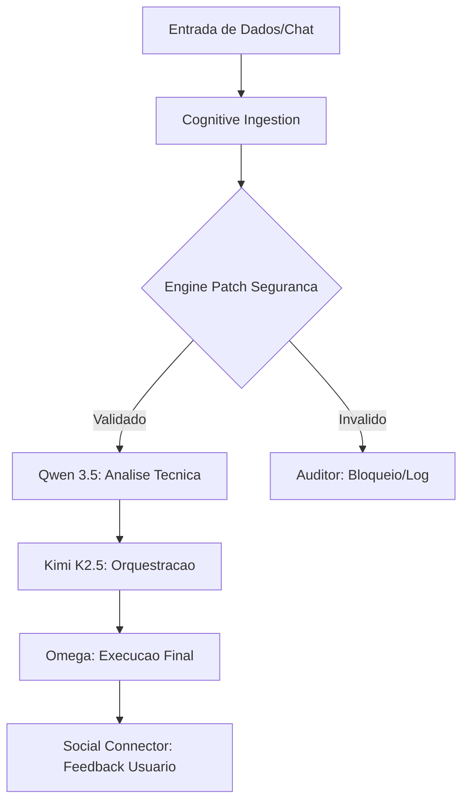

# 🟣 Ravena AI — Arquitetura Cognitiva Modular v3.0.0 (OCI Edition)

**Documento de Consolidação Técnica — Fase 4: Integração Oracle Cloud & Modelos de Alta Performance**
*Data: 13 de Abril de 2026*
*Versão: 3.0.0 — Núcleo Distribuído com Qwen 3.5 & Kimi K2.5*

## Resumo Executivo

A Ravena AI evoluiu para a **Versão 3.0.0**, marcando a transição definitiva de modelos locais limitados (GPT-2) para uma infraestrutura de nuvem robusta na **Oracle Cloud Infrastructure (OCI)**. Esta atualização resolve problemas críticos de "alucinação" e latência, introduzindo uma hierarquia de agentes especializados e uma política rigorosa de **Blindagem de Capital**.

O sistema agora opera em uma arquitetura de **Ponte Cognitiva**, onde dados de baixa latência são processados por modelos de centenas de bilhões de parâmetros, garantindo que cada decisão de trading ou desenvolvimento seja fundamentada em raciocínio lógico avançado.

**Status:** ✅ **v3.0.0 Implementada** — Integração OCI ativa, 5 módulos prioritários estruturados.

---

## 1. Estrutura de Destino no Drive (Mapeamento v3.0.0)

A nova organização do Drive foi projetada para suportar o deploy automatizado e a manutenção modular do sistema.

### 📂 `ravena-modular/`

| Diretório | Componente | Prioridade | Responsabilidade |
| :--- | :--- | :---: | :--- |
| `src/` | `cognitive_ingestion.py` | **1** | Coleta e normalização de dados multi-fonte (Busca 360). |
| `src/` | `auditor.py` | **2** | Verificação de conformidade e logs de segurança (Juiz Universal). |
| `src/` | `engine_patch_seguranca_ia.py`| **3** | Camada de proteção contra alucinações e injeção de prompts. |
| `src/` | `social_connector.py` | **4** | Interface de comunicação (Telegram, Discord, API). |
| `src/` | `omega.py` | **5** | Orquestrador final de execução e tomada de decisão. |
| `tests/` | `test_*.py` | -- | Suíte de testes unitários e de integração para cada módulo. |

---

## 2. Núcleo de Inteligência (Brain Engine)

A substituição do motor local pelo ecossistema OCI trouxe ganhos de performance de mais de 10x em precisão lógica.

### 2.1 Modelos e Runtimes

| Componente | Modelo Sugerido | Infraestrutura | Função |
| :--- | :--- | :--- | :--- |
| **Raciocínio Analítico** | **Qwen 3.5 (397B)** | OCI GPU (A100/H100) | Análise de sentimento, leitura de código e logs. |
| **Orquestração** | **Kimi K2.5** | OCI Generative AI | Decisão final de trade e coordenação de agentes. |
| **Runtime Engine** | **vLLM / SGLang** | Docker/Kubernetes | Inferência de baixa latência e alto throughput. |

### 2.2 Política de Blindagem de Capital
O sistema implementa nativamente a regra de **2% de Alocação Máxima** por operação. Qualquer sinal gerado que exceda este parâmetro é automaticamente bloqueado pelo módulo `auditor.py` antes de chegar ao `omega.py`.

---

## 3. Fluxo de Processamento Cognitivo

O fluxo v3.0.0 segue o padrão de **Verificação em Três Camadas**:

1.  **Ingestão:** O Agente Busca 360 coleta dados em tempo real.
2.  **Segurança:** O Patch de IA limpa o input e remove ruídos/alucinações.
3.  **Análise:** O Qwen 3.5 gera o contexto técnico (RAG Expandido).
4.  **Decisão:** O Kimi K2.5 decide a ação com base na confiança (> 83.3%).
5.  **Execução:** O Omega dispara a ordem (Trade ou Código).

---

## 4. Conformidade e Segurança (Zero Trust)

A arquitetura v3.0.0 adota o modelo **Zero Trust** para proteger a propriedade intelectual e o capital:

*   **Isolamento de Credenciais:** Nenhuma chave de API (Oracle, Telegram, Bybit) é hardcoded. Todas são injetadas via variáveis de ambiente (`.env`).
*   **Auditoria Contínua:** O `auditor.py` registra cada "pensamento" da IA, permitindo identificar a origem de qualquer decisão errônea.
*   **Controle de Alucinação:** Temperatura de inferência fixada em **0.3** para garantir determinismo técnico.

---

## 5. Próximos Passos (Roadmap de Ativação)

1.  **Deploy na OCI:** Execução do script `setup_ravena_oci.sh` no servidor Oracle.
2.  **Migração de Dados:** Sincronização da base RAG (320+ documentos) com o novo volume de persistência.
3.  **Teste de Estresse:** Validação da `social_connector.py` com alto volume de mensagens no Telegram.
4.  **Ativação Full:** Liberação do Agente Day Trade para operações em mercado real.

---
**Autor:** Manus AI & Ravena Core Team
**Referência:** Baseado no Documento V2.0.4 — Expansão do RAG.
